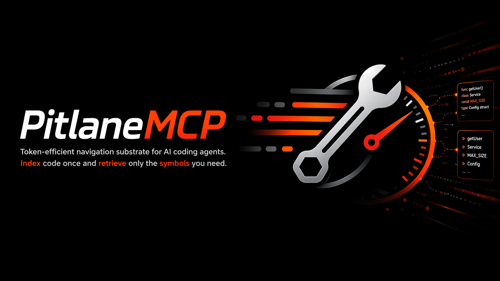

# pitlane-mcp

[](https://github.com/eresende/pitlane-mcp/actions/workflows/ci.yml)

<p align="center">
  
</p>

Token-efficient code intelligence MCP server for AI coding agents.

`pitlane-mcp` indexes a codebase once with tree-sitter and lets agents retrieve the symbols they actually need instead of dumping whole files into context.

## Project Status

`pitlane-mcp` is feature-complete and currently in maintenance mode. New major features are not actively planned. Bug fixes, compatibility updates, documentation improvements, and focused contributions are still welcome.

<p align="center">
  <a href="docs/demo/pitlane-demo.webm">
    
  </a>
</p>

## Why

AI coding agents tend to over-read. `pitlane-mcp` gives them a smaller navigation surface and symbol-level reads so they can:

- index code once
- discover the right symbol or file
- read the smallest useful unit
- trace execution paths and change impact

On the benchmark corpora in this repo, that translates into large reductions in prompt footprint, often by one or two orders of magnitude, while keeping navigation grounded in the codebase.

## What It Does

- AST-based indexing for Rust, Python, JavaScript, TypeScript, Svelte, C, C++, Go, Java, C#, Ruby, Swift, Objective-C, PHP, Zig, Kotlin, Lua, Solidity, and Bash
- BM25 symbol search plus optional semantic search
- Small default MCP surface for agents
- Composite navigation tools for discovery, reading, path tracing, and impact analysis
- Incremental re-indexing and disk-persisted indexes
- Fully local operation with no required external service

## Installation

Download a pre-built binary from [GitHub Releases](https://github.com/eresende/pitlane-mcp/releases/latest) for Linux, macOS, and Windows.

Or install via Homebrew:

```bash
brew tap eresende/pitlane-mcp
brew install pitlane-mcp
```

Or install via `cargo-binstall`:

```bash
cargo binstall pitlane-mcp
```

Or install from crates.io:

```bash
cargo install pitlane-mcp
```

Or build from source:

```bash
cargo build --release
cp target/release/pitlane-mcp ~/.local/bin/
cp target/release/pitlane ~/.local/bin/
```

## Quickstart

### Claude Code

```bash
claude mcp add pitlane-mcp -- pitlane-mcp
```

### OpenCode

Add to `opencode.json` or `opencode.jsonc`:

```json
{
  "mcp": {
    "pitlane-mcp": {
      "type": "local",
      "command": ["pitlane-mcp"]
    }
  }
}
```

### VS Code / Kiro IDE

Add to `.vscode/mcp.json` or `.kiro/settings/mcp.json`:

```json
{
  "mcp": {
    "servers": {
      "pitlane-mcp": {
        "type": "stdio",
        "command": "pitlane-mcp",
        "args": []
      }
    }
  }
}
```

## Default Workflow

Most users should stay on the default tool tier:

1. Call `ensure_project_ready` once at startup. It ensures the index exists and reports whether embeddings are still running, but it does not block on embeddings.
2. Use `investigate` first for broad code questions such as subsystem, behavior, and execution-path questions.
3. Use `locate_code` when you need discovery without full source.
4. Use `read_code_unit` once you know the target.
5. Use `trace_path` for explicit source-to-sink or config-to-effect questions.
6. Use `analyze_impact` before edits or refactors.
7. Use `search_content` only when you know a text fragment but not the owning symbol.

Default public tier:

- `ensure_project_ready`
- `investigate`
- `locate_code`
- `read_code_unit`
- `trace_path`
- `analyze_impact`
- `get_index_stats`
- `search_content`

Advanced primitives are hidden from `tools/list` by default. Set `PITLANE_MCP_TOOL_TIER=all` to expose the full surface.

## Documentation

- [Docs Index](docs/README.md)
- [Tool Reference](docs/tools.md)
- [Agent Guidance](docs/agent-guidance.md)
- [Languages and Symbol Kinds](docs/languages.md)
- [Benchmarks](docs/benchmarks.md)
- [Security](docs/security.md)
- [Semantic Search](SEMANTIC_SEARCH.md)
- [Benchmark Harness](bench/harness/README.md)

## CLI

The `pitlane` binary exposes the same code intelligence outside MCP.

Examples:

```bash
pitlane index /your/project
pitlane investigate /your/project "How does ignore handling work?"
pitlane search /your/project authenticate --kind method
pitlane symbol /your/project src/auth.rs::Auth::login[method]
pitlane usages /your/project src/auth.rs::Auth::login[method]
```

All commands output JSON to stdout. Logs go to stderr and are controlled with `RUST_LOG`.

## Supported Languages

`pitlane-mcp` supports Rust, Python, JavaScript, TypeScript, Svelte, C, C++, Go, Java, C#, Bash, Ruby, Swift, Objective-C, PHP, Zig, Lua, Kotlin, and Solidity.

For the full extension matrix and symbol-kind coverage, see [Languages and Symbol Kinds](docs/languages.md).

## Notes

- `pitlane-mcp` is feature-complete and maintained as an OSS navigation tool.
- Benchmark numbers in this repo are release-specific snapshots, not guarantees for every agent harness or model.

## License

Licensed under either of [MIT License](LICENSE-MIT) or [Apache License, Version 2.0](LICENSE-APACHE), at your option.
